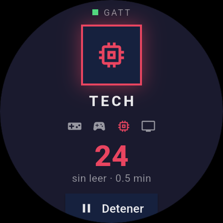
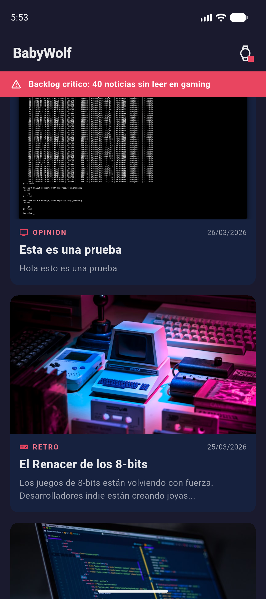
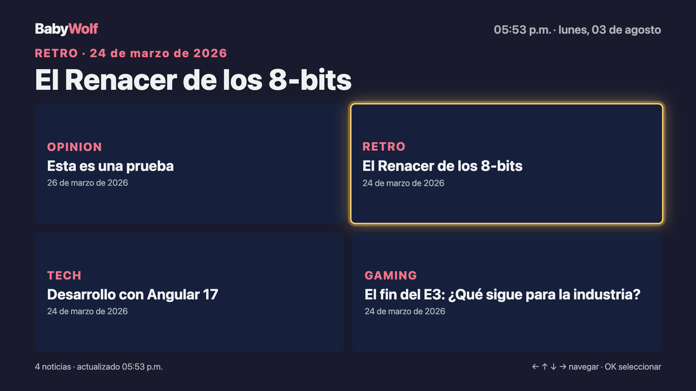

# Reporte de configuración de herramientas y emuladores

Materia: Desarrollo para Dispositivos Inteligentes · Evaluación 2 · Mayo–Agosto 2026

Entorno real con el que se construyó y probó el ecosistema. Todas las versiones
salen de ejecutar los comandos indicados en esta misma máquina.

---

## 1. Configuración de herramientas

### 1.1 Equipo

| Concepto | Valor |
|---|---|
| Sistema operativo | macOS 26.5.2 |
| Arquitectura | `arm64` (Apple Silicon) |

La arquitectura importa: los emuladores usan imágenes `arm64-v8a`, no `x86_64`.
En una máquina Intel hay que descargar las imágenes correspondientes.

### 1.2 Flutter y Dart

```console
$ flutter --version
Flutter 3.44.0 • channel stable • https://github.com/flutter/flutter.git
Framework • revision 559ffa3f75 (3 months ago) • 2026-05-15 14:13:13 -0700
Engine • hash fcf463a2242790d1fdcd9d044f533080f5022e18 (revision 4c525dac5e)
Tools • Dart 3.12.0 • DevTools 2.57.0
```

| Componente | Versión |
|---|---|
| Flutter SDK | 3.44.0 (canal stable) |
| Dart SDK | 3.12.0 |
| DevTools | 2.57.0 |

Dart se usa también **fuera de Flutter**: el hub es un programa de línea de
comandos que corre con `dart run hub/hub.dart`.

### 1.3 Android Studio y JDK

| Componente | Versión |
|---|---|
| Android Studio | 2025.3 |
| JDK | OpenJDK 25 (build 25+36-3489) |
| Android SDK | `~/Library/Android/sdk` |

Plugins necesarios en Android Studio: **Flutter** y **Dart** (el de Flutter
arrastra el de Dart como dependencia).

### 1.4 Herramientas de la Unidad 3 (pantallas inteligentes)

| Herramienta | Versión | Para qué se usa aquí |
|---|---|---|
| Google Chrome | 150.0.7871.129 | Ejecutar la PWA y emular la TV con DevTools |
| Chrome DevTools | incluido | Modo dispositivo 1920×1080, panel Application (SW y cache) |
| VS Code | — | Edición de la PWA (HTML/CSS/JS) |
| Python 3 | 3.12.9 | `http.server` para servir la PWA en local |
| ffmpeg | 8.0.1 | Instalado y disponible |

**Nota honesta sobre ffmpeg.** Está instalado, pero **este proyecto no lo
utiliza**: el recurso multimedia de fondo de la Smart TV es una imagen de portada
que viene de la API, no un video. No se transcodificó ningún archivo. Se
documenta la versión porque el programa de la asignatura pide reportar la
herramienta, no porque haya video en la entrega.

### 1.5 Dependencias del proyecto

**`phone_app/pubspec.yaml`**

| Paquete | Versión | Para qué |
|---|---|---|
| `http` | ^1.6.0 | Llamadas a la API del blog y al hub |
| `provider` | ^6.1.5+1 | Estado del wearable compartido con la UI |
| `flutter_lints` | ^6.0.0 | Análisis estático |
| `flutter_launcher_icons` | ^0.14.4 | Ícono propio (lobo pixel) |

**`wearable_app/pubspec.yaml`**

| Paquete | Versión | Para qué |
|---|---|---|
| `flutter_lints` | ^6.0.0 | Análisis estático |
| `flutter_launcher_icons` | ^0.14.4 | Ícono propio (lobo pixel) |

**`hub/hub.dart`: cero dependencias.** Usa sólo `dart:io`, que ya trae
`HttpServer` y `WebSocketTransformer`. No hay `pubspec.yaml` ni `pub get`.

**`tv_pwa/`: cero dependencias.** HTML, CSS y JavaScript sin framework ni CDN.
Esto no es sólo simplicidad: al no cargar recursos externos, no hay ningún
`<script src="https://...">` que verificar con SRI ni que pueda ser comprometido.

### 1.6 Pasos de instalación reproducibles

Partiendo de una máquina limpia:

```bash
# 1. Flutter (macOS, Apple Silicon)
git clone https://github.com/flutter/flutter.git -b stable ~/development/flutter
export PATH="$PATH:$HOME/development/flutter/bin"
flutter doctor          # debe quedar sin errores en Android toolchain

# 2. Android Studio -> Settings -> Plugins -> instalar "Flutter"
#    Settings -> SDK Manager -> SDK Tools -> Android SDK Command-line Tools

# 3. Aceptar licencias
flutter doctor --android-licenses

# 4. Clonar el ecosistema y bajar dependencias
git clone <url-del-repo> babywolf-ecosystem
cd babywolf-ecosystem
(cd phone_app && flutter pub get)
(cd wearable_app && flutter pub get)

# 5. Regenerar los íconos (opcional: ya están versionados)
python3 tools/gen_icons.py
(cd phone_app && dart run flutter_launcher_icons)
(cd wearable_app && dart run flutter_launcher_icons)

# 6. Verificar que todo compila
(cd wearable_app && flutter test && flutter analyze)
(cd phone_app && flutter analyze)
```

---

## 2. Configuración de emuladores

### 2.1 Emulador de teléfono

| Parámetro | Valor |
|---|---|
| AVD ID | `Pixel_9` |
| Dispositivo | Pixel 9 |
| **API level** | **37** (`system-images/android-37.0/google_apis_playstore/arm64-v8a`) |
| ABI | `arm64-v8a` |
| **RAM asignada** | **2048 MB** |
| Target | `google_apis_playstore` |

```bash
~/Library/Android/sdk/emulator/emulator -avd Pixel_9
```

### 2.2 Emulador de wearable

| Parámetro | Valor |
|---|---|
| AVD ID | `Wear_OS_Large_Round` |
| **Forma** | **Redonda** (`wearos_large_round`) |
| Resolución | 454 × 454 px |
| **API level** | **36** (`system-images/android-36/android-wear-signed/arm64-v8a`) |
| ABI | `arm64-v8a` |
| RAM en el AVD | 512 MB — **insuficiente**, ver 3.1 |
| **RAM usada realmente** | **1536 MB** (por parámetro de arranque) |

```bash
~/Library/Android/sdk/emulator/emulator -avd Wear_OS_Large_Round \
  -memory 1536 -no-snapshot -no-boot-anim
```

### 2.3 Emulación de la Smart TV en Chrome DevTools

La PWA no corre en un emulador de Android TV, sino en Chrome configurado como un
televisor:

1. Servir la PWA: `cd tv_pwa && python3 -m http.server 3000`
2. Abrir <http://localhost:3000>
3. `F12` → icono de dispositivo (`Ctrl/Cmd + Shift + M`)
4. **Dimensions: Responsive → 1920 × 1080**, zoom al 50 % para que quepa
5. Panel **Application → Service Workers** para comprobar que el SW está activo
6. Panel **Application → Cache Storage** para ver `babywolf-tv-static-v1`

**User agent.** Se usa el de Chrome de escritorio sin modificar
(`Mozilla/5.0 (Macintosh; Intel Mac OS X 10_15_7) AppleWebKit/537.36 (KHTML,
like Gecko) Chrome/150.0.0.0 Safari/537.36`). La app no cambia de comportamiento
según el user agent: se adapta por resolución y por la navegación con D-pad, que
son teclas de flecha reales. Un televisor envía exactamente esas teclas.

### 2.4 Los tres a la vez

```bash
# Terminal 1 — el aire entre dispositivos
dart run hub/hub.dart

# Terminal 2 — la Smart TV
cd tv_pwa && python3 -m http.server 3000

# Terminal 3 — los emuladores
~/Library/Android/sdk/emulator/emulator -avd Pixel_9 &
~/Library/Android/sdk/emulator/emulator -avd Wear_OS_Large_Round -memory 1536 &

# Terminal 4 — las apps
(cd wearable_app && flutter run -d emulator-5554)
(cd phone_app && flutter run -d emulator-5556)
```

Los identificadores `emulator-5554` / `emulator-5556` se asignan por orden de
arranque, no por tipo de dispositivo. Conviene confirmarlos:

```bash
adb devices
adb -s emulator-5556 emu avd name     # imprime el AVD que corre ahí
```

### 2.5 Evidencia: cada emulador corriendo

**Emulador Wear OS** (`Wear_OS_Large_Round`, 454×454, redondo, API 36) con la app
generando datos. El punto verde indica que el enlace GATT está establecido:



**Emulador de teléfono** (`Pixel_9`, API 37, 2048 MB) mostrando el feed con datos
reales de la API:



**Emulación de Smart TV** en Chrome a 1920×1080, con el grid 2×2 y el foco del
D-pad sobre la primera tarjeta:



El resto de capturas —alerta de umbral, desconexión del wearable, error de red,
APK firmado— están en [`evidencias/`](evidencias/) y se referencian desde
[PLAN_PRUEBAS.md](PLAN_PRUEBAS.md).

---

## 3. Problemas encontrados y cómo se resolvieron

Todos ocurrieron durante esta entrega.

### 3.1 El emulador Wear OS se queda en `offline` para siempre

**Síntoma.** `adb devices` mostraba `emulator-5554  offline` indefinidamente. El
proceso del emulador existía, la ventana abría, pero el sistema nunca terminaba
de arrancar y `adb wait-for-device` se colgaba más de dos minutos.

**Causa.** El AVD venía con `hw.ramSize=512`. Con 512 MB, la imagen de Wear OS
API 36 no alcanza a completar el arranque en Apple Silicon.

**Solución.** Arrancarlo con más memoria:

```bash
pkill -f "emulator.*Wear_OS_Large_Round"
~/Library/Android/sdk/emulator/emulator -avd Wear_OS_Large_Round -memory 1536 -no-snapshot
```

Pasó a `device` en menos de 10 segundos. Alternativa permanente: subir
`hw.ramSize` en `~/.android/avd/Wear_OS_Large_Round.avd/config.ini`.

### 3.2 La PWA no podía leer la API: `TypeError: Failed to fetch`

**Síntoma.** La PWA cargaba, pero el pie mostraba "Sin conexión con la API
(Failed to fetch)". No había ningún aviso de CSP en la consola.

**Causa.** No era la CSP sino **CORS**. El backend sólo autoriza ciertos
orígenes (`middleware/cors.go`), y la PWA se estaba sirviendo en el puerto 8080,
que no está en la lista.

**Solución.** Servirla en un puerto que el backend ya permite:

```bash
cd tv_pwa && python3 -m http.server 3000    # 3000 y 4200 están autorizados
```

Se prefirió esto antes que tocar el backend en producción: cero cambios y cero
despliegues. **El puerto 3000 no es opcional.**

### 3.3 Los cambios de CSS y JS no se veían al recargar

**Síntoma.** Tras editar `styles.css`, la PWA seguía mostrando la versión vieja.

**Causa.** El service worker sirve los estáticos con Cache First. Está bien en
producción, pero durante el desarrollo devuelve siempre la copia guardada.

**Solución.** Vaciar el SW y las caches desde la consola:

```js
navigator.serviceWorker.getRegistrations().then(rs => rs.forEach(r => r.unregister()));
caches.keys().then(ks => ks.forEach(k => caches.delete(k)));
```

Y recargar. Al publicar cambios reales, subir la versión en `CACHE_ESTATICO`
(`babywolf-tv-static-v1` → `-v2`): el evento `activate` borra las caches viejas.

### 3.4 El wearable no se comunicaba con el hub

**Síntoma.** El indicador del reloj se quedaba en "SIN ENLACE".

**Causa.** Dos cosas a la vez: faltaba el permiso `INTERNET` en el manifest, y
Android 9+ bloquea el tráfico en claro, que es lo que usa `ws://` contra el hub
local.

**Solución.** En el `AndroidManifest.xml` de ambas apps:

```xml
<uses-permission android:name="android.permission.INTERNET" />
<application android:usesCleartextTraffic="true" ...>
```

`usesCleartextTraffic` es aceptable aquí porque el único destino sin cifrar es el
hub en `10.0.2.2` — la máquina de desarrollo, no una red pública. La API del blog
sí viaja por HTTPS.

### 3.5 La app no se instalaba en el emulador Wear OS

**Síntoma.** El APK compilaba pero el sistema de reloj no lo aceptaba.

**Causa.** Falta la declaración que marca la app como de reloj.

**Solución.** En `wearable_app/android/app/src/main/AndroidManifest.xml`:

```xml
<uses-feature android:name="android.hardware.type.watch" />
```

### 3.6 `10.0.2.2` no funciona desde la PWA

**Síntoma.** Al reutilizar la constante del hub en la PWA, el sondeo fallaba.

**Causa.** `10.0.2.2` es un alias que **sólo existe dentro del emulador de
Android** y apunta al host. La PWA corre en el host, donde ese alias no lleva a
ningún lado.

**Solución.** Cada lado usa la dirección que le corresponde: los emuladores
`10.0.2.2:8090` (`gatt_constants.dart`) y la PWA `localhost:8090` (`sync.js`).

---

**Alumno:** Luis Abraham Camacho Durán    **Fecha:** 03 de agosto de 2026

**Firma:** ___________________________________
